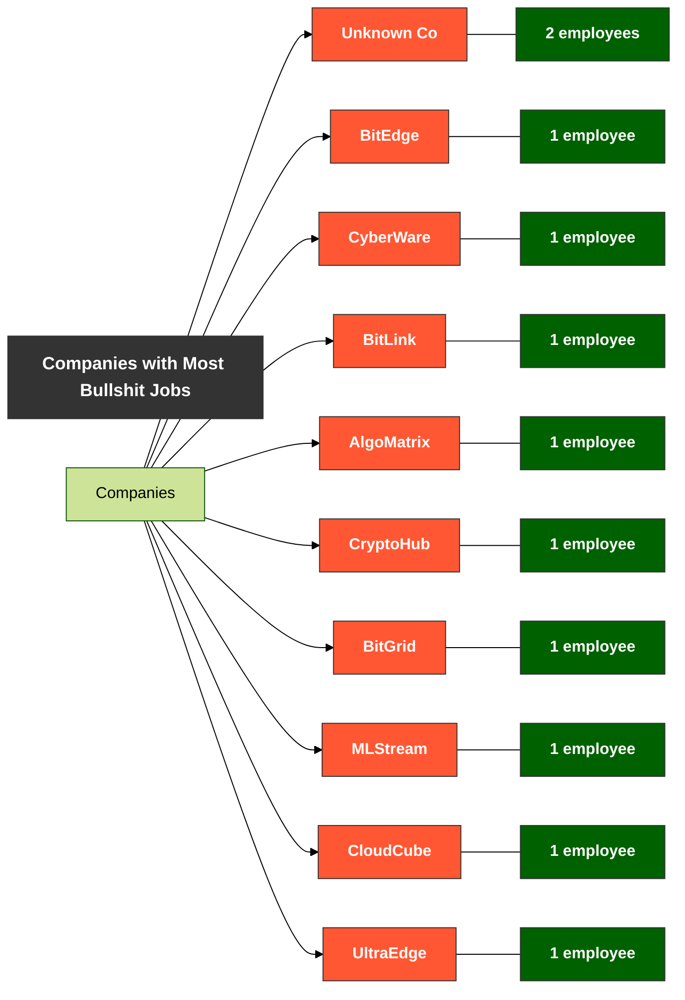
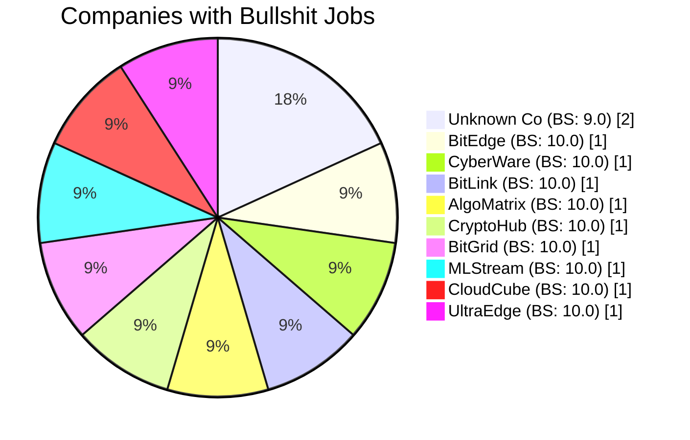

# Trino MCP Server

Model Context Protocol server for Trino, providing AI models with structured access to Trino's distributed SQL query engine.

⚠️ **EARLY DEVELOPMENT STAGE (v0.1)** ⚠️  
This project is in early development with many features still being implemented and tested. Feel free to fork and contribute! Use accordingly.

## Features

- Exposes Trino resources through MCP protocol
- Enables AI tools to query and analyze data in Trino
- Provides transport options (STDIO transport works reliably; SSE transport has serious issues)
- Fixed catalog handling for proper Trino query execution

## LLM Integration

Want to give an LLM direct access to query your Trino instance? We've created simple tools for that!

### Command-Line LLM Interface

The simplest way to let an LLM query Trino is through our command-line tool:

```bash
# Simple direct query (perfect for LLMs)
python llm_query_trino.py "SELECT * FROM memory.bullshit.real_bullshit_data LIMIT 5"

# Specify a different catalog or schema
python llm_query_trino.py "SELECT * FROM information_schema.tables" memory information_schema
```

### REST API for LLMs

For more integrated experiences, run the REST API server:

```bash
# Install FastAPI and uvicorn first
pip install fastapi uvicorn

# Start the API server
uvicorn llm_trino_api:app --reload
```

This creates endpoints at:
- `GET http://localhost:8000/` - API usage info
- `POST http://localhost:8000/query` - Execute SQL queries

You can then have your LLM make HTTP requests to this endpoint:

```python
# Example code an LLM might generate
import requests

def query_trino(sql_query):
    response = requests.post(
        "http://localhost:8000/query",
        json={"query": sql_query}
    )
    return response.json()

# LLM-generated query
results = query_trino("SELECT job_title, AVG(salary) FROM memory.bullshit.real_bullshit_data GROUP BY job_title ORDER BY AVG(salary) DESC LIMIT 5")
print(results["formatted_results"])
```

This approach allows LLMs to focus on generating SQL, while our tools handle all the MCP protocol complexity!

## Demo and Validation Scripts 🚀

We've created some badass demo scripts that show how AI models can use the MCP protocol to run complex queries against Trino:

### 1. Bullshit Data Generation and Loading

The `tools/create_bullshit_data.py` script generates a dataset of 10,000 employees with ridiculous job titles, inflated salaries, and a "bullshit factor" rating (1-10):

```bash
# Generate the bullshit data
python tools/create_bullshit_data.py

# Load the bullshit data into Trino's memory catalog
python load_bullshit_data.py
```

### 2. Running Complex Queries through MCP

The `test_bullshit_query.py` script demonstrates end-to-end MCP interaction:
- Connects to the MCP server using STDIO transport
- Initializes the protocol following the MCP spec
- Runs a complex SQL query with WHERE, GROUP BY, HAVING, ORDER BY
- Processes and formats the results

```bash
# Run a complex query against the bullshit data through MCP
python test_bullshit_query.py
```

Example output showing top BS jobs with high salaries:
```
🏆 TOP 10 BULLSHIT JOBS (high salary, high BS factor):
----------------------------------------------------------------------------------------------------
JOB_TITLE             | COUNT                | AVG_SALARY           | MAX_SALARY           | AVG_BS_FACTOR        
----------------------------------------------------------------------------------------------------
Advanced Innovation Jedi | 2                    |            241178.50 |            243458.00 |                 7.50
VP of Digital Officer | 1                    |            235384.00 |            235384.00 |                 7.00
Innovation Technical Architect | 1                    |            235210.00 |            235210.00 |                 9.00
...and more!
```

### 3. Validation for LLMs

These scripts demonstrate how an LLM agent could use the MCP to:
1. Initialize a connection to Trino via MCP
2. Set the correct catalog context (essential for getting results)
3. Run complex queries with proper SQL syntax
4. Process the nested JSON response format
5. Parse and present the results to users

## Usage

```bash
# Start the server with docker-compose
docker-compose up -d
```

The server will be available at:
- Trino: http://localhost:9095
- MCP server: http://localhost:9096

## Client Connection

✅ **IMPORTANT**: The client scripts run on your local machine (OUTSIDE Docker) and connect TO the Docker containers. The scripts automatically handle this by using docker exec commands. You don't need to be inside the container to use MCP!

Running tests from your local machine:

```bash
# Generate and load data into Trino
python tools/create_bullshit_data.py  # Generates data locally
python load_bullshit_data.py          # Loads data to Trino in Docker

# Run MCP query through Docker
python test_bullshit_query.py         # Queries using MCP in Docker
```

## Transport Options

This server supports two transport methods, but only STDIO is currently reliable:

### STDIO Transport (Recommended and Working)

STDIO transport works reliably and is currently the only recommended method for testing and development:

```bash
# Run with STDIO transport inside the container
docker exec -i trino_mcp_trino-mcp_1 python -m trino_mcp.server --transport stdio --debug --trino-host trino --trino-port 8080 --trino-user trino --trino-catalog memory
```

### SSE Transport (NOT RECOMMENDED - Has Critical Issues)

SSE is the default transport in MCP but has serious issues with the current MCP 1.3.0 version, causing server crashes on client disconnections. **Not recommended for use until these issues are resolved**:

```bash
# NOT RECOMMENDED: Run with SSE transport (crashes on disconnection)
docker exec trino_mcp_trino-mcp_1 python -m trino_mcp.server --transport sse --host 0.0.0.0 --port 8000 --debug
```

## Known Issues

### MCP 1.3.0 SSE Transport Crashes

There's a critical issue with MCP 1.3.0's SSE transport that causes server crashes when clients disconnect. Until a newer MCP version is integrated, use STDIO transport exclusively. The error manifests as:

```
RuntimeError: generator didn't stop after athrow()
anyio.BrokenResourceError
```

### Trino Catalog Handling

We fixed an issue with catalog handling in the Trino client. The original implementation attempted to use `USE catalog` statements, which don't work reliably. The fix directly sets the catalog in the connection parameters.

## Project Structure

This project is organized as follows:

- `src/` - Main source code for the Trino MCP server
- `examples/` - Simple examples showing how to use the server
- `scripts/` - Useful diagnostic and testing scripts
- `tools/` - Utility scripts for data creation and setup
- `tests/` - Automated tests

Key files:
- `test_mcp_stdio.py` - Main test script using STDIO transport (recommended)
- `test_bullshit_query.py` - Complex query example with bullshit data
- `load_bullshit_data.py` - Script to load generated data into Trino
- `tools/create_bullshit_data.py` - Script to generate hilarious test data
- `run_tests.sh` - Script to run automated tests
- `examples/simple_mcp_query.py` - Simple example to query data using MCP

## Development

**IMPORTANT**: All scripts can be run from your local machine - they'll automatically communicate with the Docker containers via docker exec commands!

```bash
# Install development dependencies
pip install -e ".[dev]"

# Run automated tests 
./run_tests.sh

# Test MCP with STDIO transport (recommended)
python test_mcp_stdio.py

# Simple example query
python examples/simple_mcp_query.py "SELECT 'Hello World' AS message"
```

## Testing

To test that Trino queries are working correctly, use the STDIO transport test script:

```bash
# Recommended test method (STDIO transport)
python test_mcp_stdio.py
```

For more complex testing with the bullshit data:
```bash
# Load and query the bullshit data (shows the full power of Trino MCP!)
python load_bullshit_data.py
python test_bullshit_query.py
```

This demonstrates end-to-end flow including:
1. Initializing the MCP connection
2. Listing available tools
3. Executing complex queries against Trino
4. Handling errors appropriately
5. Processing nested JSON responses

For SSE transport testing (currently broken with MCP 1.3.0):
```bash
# DO NOT USE until MCP SSE issues are fixed
python scripts/test_messages.py
```

## How LLMs Can Use This

LLMs can use the Trino MCP server to:

1. **Get Database Schema Information**:
   ```python
   # Example prompt to LLM: "What schemas are available in the memory catalog?"
   # LLM can generate code to query:
   query = "SHOW SCHEMAS FROM memory"
   ```

2. **Run Complex Analytical Queries**:
   ```python
   # Example prompt: "Find the top 5 job titles with highest average salaries"
   # LLM can generate complex SQL:
   query = """
   SELECT 
     job_title, 
     AVG(salary) as avg_salary
   FROM 
     memory.bullshit.real_bullshit_data
   GROUP BY 
     job_title
   ORDER BY 
     avg_salary DESC
   LIMIT 5
   """
   ```

3. **Perform Data Analysis and Present Results**:
   ```python
   # LLM can parse the response, extract insights and present to user:
   "The highest paying job title is 'Advanced Innovation Jedi' with an average salary of $241,178.50"
   ```

### Real LLM Analysis Example: Bullshit Jobs by Company

Here's a real example of what an LLM could produce when asked to "Identify the companies with the most employees in bullshit jobs and create a Mermaid chart":

#### Step 1: LLM generates and runs the query

```sql
SELECT 
  company, 
  COUNT(*) as employee_count, 
  AVG(bullshit_factor) as avg_bs_factor 
FROM 
  memory.bullshit.real_bullshit_data 
WHERE 
  bullshit_factor > 7 
GROUP BY 
  company 
ORDER BY 
  employee_count DESC, 
  avg_bs_factor DESC 
LIMIT 10
```

#### Step 2: LLM gets and analyzes the results

```
COMPANY | EMPLOYEE_COUNT | AVG_BS_FACTOR
----------------------------------------
Unknown Co | 2 | 9.0
BitEdge | 1 | 10.0
CyberWare | 1 | 10.0
BitLink | 1 | 10.0
AlgoMatrix | 1 | 10.0
CryptoHub | 1 | 10.0
BitGrid | 1 | 10.0
MLStream | 1 | 10.0
CloudCube | 1 | 10.0
UltraEdge | 1 | 10.0
```

#### Step 3: LLM generates a Mermaid chart visualization



**Alternative Bar Chart:**



#### Step 4: LLM provides key insights

The LLM can analyze the data and provide insights:

- "Unknown Co" has the most employees in bullshit roles (2), while all others have just one
- Most companies have achieved a perfect 10.0 bullshit factor score
- Tech-focused companies (BitEdge, CyberWare, etc.) seem to create particularly meaningless roles
- Bullshit roles appear concentrated at executive or specialized position levels

This example demonstrates how an LLM can:
1. Generate appropriate SQL queries based on natural language questions
2. Process and interpret the results from Trino
3. Create visual representations of the data
4. Provide meaningful insights and analysis

## Future Work

This is an early v0.1 version with many planned improvements:

- [ ] Integrate with newer MCP versions when available to fix SSE transport issues
- [ ] Add/Validate support for Hive, JDBC, and other connectors
- [ ] Add more comprehensive query validation across different types and complexities
- [ ] Implement support for more data types and advanced Trino features
- [ ] Improve error handling and recovery mechanisms
- [ ] Add user authentication and permission controls
- [ ] Create more comprehensive examples and documentation
- [ ] Develop admin monitoring and management interfaces
- [ ] Add performance metrics and query optimization hints
- [ ] Implement support for long-running queries and result streaming

## License

MIT License

Copyright (c) 2023 Trino MCP Team

Permission is hereby granted, free of charge, to any person obtaining a copy
of this software and associated documentation files (the "Software"), to deal
in the Software without restriction, including without limitation the rights
to use, copy, modify, merge, publish, distribute, sublicense, and/or sell
copies of the Software, and to permit persons to whom the Software is
furnished to do so, subject to the following conditions:

The above copyright notice and this permission notice shall be included in all
copies or substantial portions of the Software.

THE SOFTWARE IS PROVIDED "AS IS", WITHOUT WARRANTY OF ANY KIND, EXPRESS OR
IMPLIED, INCLUDING BUT NOT LIMITED TO THE WARRANTIES OF MERCHANTABILITY,
FITNESS FOR A PARTICULAR PURPOSE AND NONINFRINGEMENT. IN NO EVENT SHALL THE
AUTHORS OR COPYRIGHT HOLDERS BE LIABLE FOR ANY CLAIM, DAMAGES OR OTHER
LIABILITY, WHETHER IN AN ACTION OF CONTRACT, TORT OR OTHERWISE, ARISING FROM,
OUT OF OR IN CONNECTION WITH THE SOFTWARE OR THE USE OR OTHER DEALINGS IN THE
SOFTWARE.
